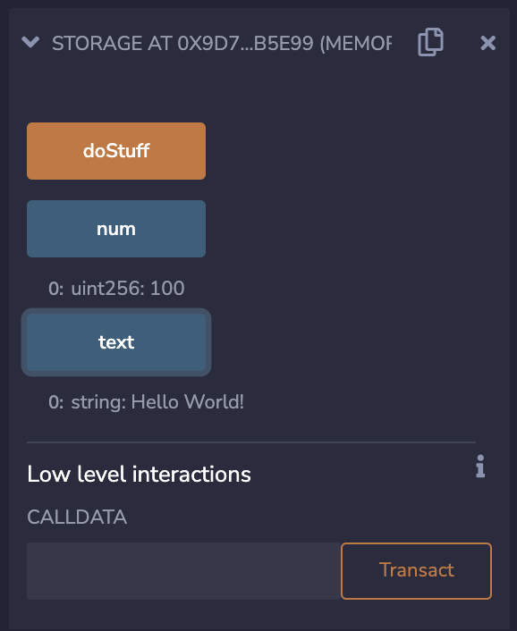
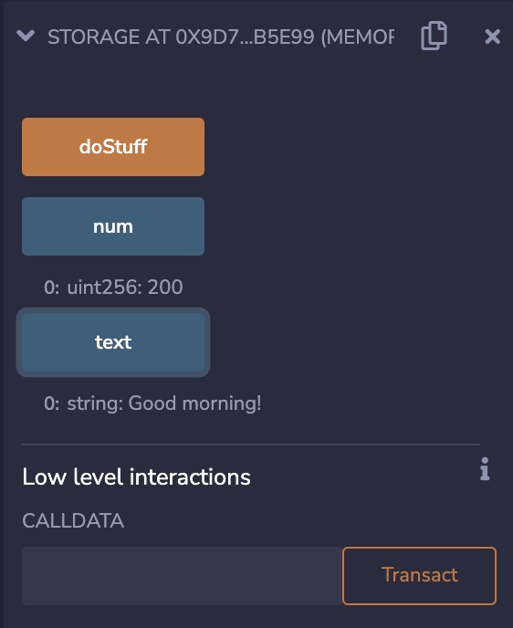

# 2. 变量与常量

## 变量的定义方式
变量和常量是几乎所有编程语言中非常重要的概念，那么在 Solidity 当中变量和常量是怎么样的呢？

要定一个变量，我们必须这样注明：
```
<类型> <访问修饰符> <变量名> ; 
```
Solidity 支持很多常见的数据类型，包括：整型、布尔类型、定长浮点型、地址类型、字节等，我们会在之后的小节对常用的数据类型进行讲解。

由于 Solidity 语言如同其它语言支持继承，因此也有相应的访问修饰符访问修饰。此阶段，我们只会用到 `public`，在之后的小节将介绍其他的访问修饰符。`public` 的变量可以在 Remix 的部署栏查看。

最后，变量必须有合法的变量名。在同一个局域内，变量名不能重复。

## 变量的种类
Solidity 的变量可以分成三种：状态变量、局部变量和全局变量。

### 状态变量
> `state-variable.sol`
```solidity
pragma solidity ^0.8.10;

contract State {
    // 两个状态变量
    string public text = "Hello World!";
    uint public num = 100;

    function doStuff() public {
        text = "Good morning!";
        num = 200;
    }
}
```
THUBA DAO版权所有，盗用必究
状态变量是定义在合约当中，但成员函数以外的变量。这些变量会永久储存在合约的存储空间中。

在 Remix 编译并部署这一段代码，可以发现起初 `text = "Hello World!"` 以及 `num = 100`。调用 `doStuff()` 函数，可以发现这两个变量的值分别变成 `"Good morning!"` 和 `200`。再检查这两个变量的值，他们的值仍然还是 `"Good morning!"` 和 `200`。


`doStuff()` 前。


`doStuff()` 后，新的值仍然还保存在这个部署了的合约内。


### 局部变量
> `local-variable.sol`
```solidity
pragma solidity ^0.8.10;

contract Local {
    function someFunction() public {
        uint num = 150; // 局部变量
    }
}
```
局部变量是一个定义在函数内的变量，它仅会在函数调用期间有效，函数返回之后则无效。

### 全局变量
> `global-variable.sol`
```solidity
pragma solidity ^0.8.10;

contract Global {
    uint public timestamp = block.timestamp; // 获取当前时间
    address public sender = msg.sender; // 调用函数用户的地址
}
```
全局变量是用来获取区块链信息的变量，以上的代码使用了两个全局变量，`block.timestamp` 和 `msg.sender`。这两个全局变量分别获取当前区块链中的时间，还有调用这个函数的用户地址。

## 常量的定义方式
不同于变量，常量被赋予的值在之后是不能进行修改的。定义常量和变量类似，但是必须注明 `constant`。

```solidity
pragma solidity ^0.8.10;

contract Constants {
    uint public constant NUM = 123;
}
```

这些是变量和常量的简介，下一小节开始，我们将介绍各种常见的数据类型。

参考资料
1. https://solidity-by-example.org/variables
2. https://www.lidihuo.com/solidity/solidity-variable.html
3. https://solidity-cn.readthedocs.io/zh/develop/types.html
