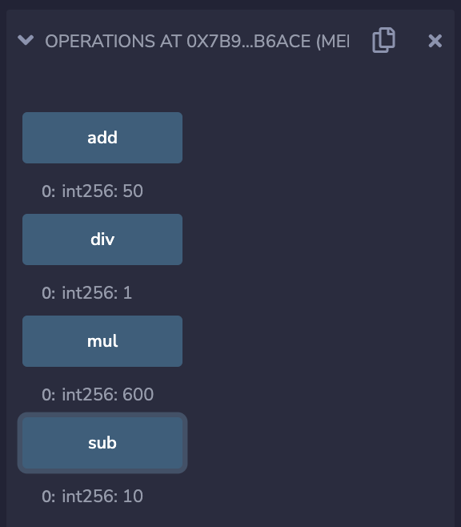
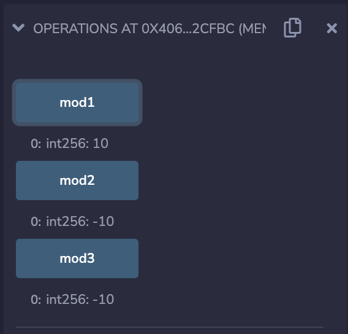
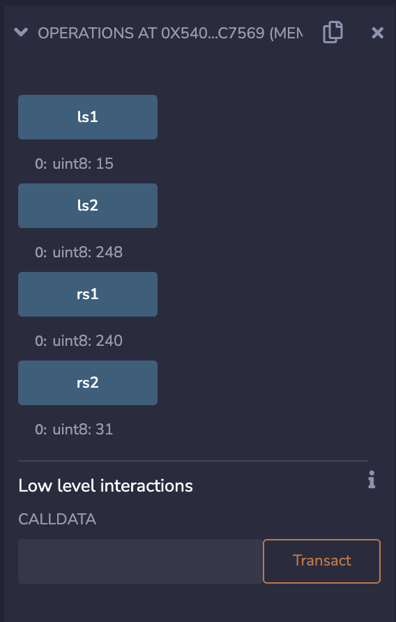

# 3a 整型

整型数据主要用来记录正整数和负整数的。

## 整型的大小

Solidity 中默认的 `int` 和 `uint` 都是 256 位的长度，除了这两种，还有：

1. 8 位的 `int8` 和 `uint8`
2. 16 位的 `int16` 和 `uint16`
3. 32 位的 `int32` 和 `uint32`。

## 带符号 vs 不带符号

带符号的整型数据类型可以用来记录负整数，不带符号的只可以记录包括 0 和正整数。

每种整型变量都有各自的范围，而这个范围由他们的大小 `n` 所定。

对于带符号的整型范围：[-2^(n-1), 2^(n-1) - 1] \
对于不带符号的整型范围：[0, 2^n - 1]

> `Integers.sol`
```solidity
pragma solidity ^0.8.10;

contract Integers {
    // 256 bit
    int public num1 = 2**255 - 1;   // 最小值 -2**255
    uint public num2 = 2**256 - 1;  // 最小值 0

     // 8 bit
    int8 public num3 = 2**7 - 1;    // 最小值 -2**7
    uint8 public num4 = 2**8 - 1;   // 最小值 0
    
    // 16 bit
    int16 public num5 = 2**15 - 1;  // 最小值 -2**15
    uint16 public num6 = 2**16 - 1; // 最小值 0

    // 32 bit
    int32 public num7 = 2**31 - 1;  // 最小值 -2**31
    uint32 public num8 = 2**32 - 1; // 最小值 0
}
```

## 整型的操作

### 四则运算
Solidity 的整型数据支持四则运算，也就是小学所学的加、减、乘、除。

> `Operations-1.sol`
```solidity
pragma solidity ^0.8.10;

contract Operations {
    int num1 = 20;
    int num2 = 30;

    int public add = num1 + num2;   // 50
    int public sub = num2 - num1;   // 10
    int public mul = num1 * num2;   // 600
    int public div = num2 / num1;   // 1
}
```

加、减和乘的结果都是我们预想的。但对于除法，由于整型数据不记录小数，因此 30/20 = 1.5 只取 1，舍去 0.5。这个性质可以被用作 floor division。



### 取模
取模运算是用来提取两个数进行除法后的余数。例如：5 除 2 的余数是 1，因此 5 % 2 = 1。

> `Operations-2.sol`
```solidity
pragma solidity ^0.8.10;

contract Operations {
    int num1 = 100;
    int num2 = 30;

    int public mod1 = num1 % num2;   // 10

    int num3 = -100;
    int public mod2 = num3 % num2;  // -10

    int num4 = -30;
    int public mod3 = num3 % num4;  // -10
}
```



可以发现，这个负整数也是可以进行取模运算的，而且结果也是负整数。

### 指数
指数运算的操作符号是 `**`。需要注意的是，这个操作的指数必须是一个不带符号整型，必须是一个正整数！

>`Operations-3.sol`
```solidity
pragma solidity ^0.8.10;

contract Operations {
    int num1 = 2;
    uint num2 = 10;     // 不带符号整型！
    int public exp = num1 ** num2;
}
```

### 左右移
左右移运算的作用在于，将一个数当作二进制来看待，并按位将这个数向左或右“移动”。

> `Operations-4.sol`
```solidity
pragma solidity ^0.8.10;

contract Operations {
    uint8 num1 = 0x3c;              // 二进制：0011 1100
    uint8 public ls1 = num1 >> 2;   // 0011 1100 >> 2 = 0000 1111 = 15
    uint8 public rs1 = num1 << 2;   // 0011 1100 << 2 = 1111 0000 = 240


    uint8 num2 = 0xff;              // 二进制：1111 1111
    uint8 public ls2 = num2 << 3;   // 1111 1111 << 3 = 1111 1000 = 248
    uint8 public rs2 = num2 >> 3;   // 1111 1111 >> 3 = 0001 1111 = 31
}
```


可以观察到，`num2` 位移之后，由于这些数移动后的结果超过了原有的8位范围，那么这些超过范围的数会被“截断”。

THUBA DAO版权所有，盗用必究