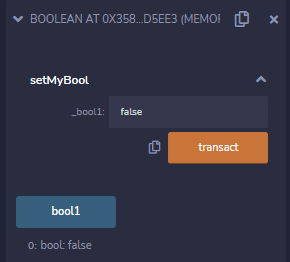
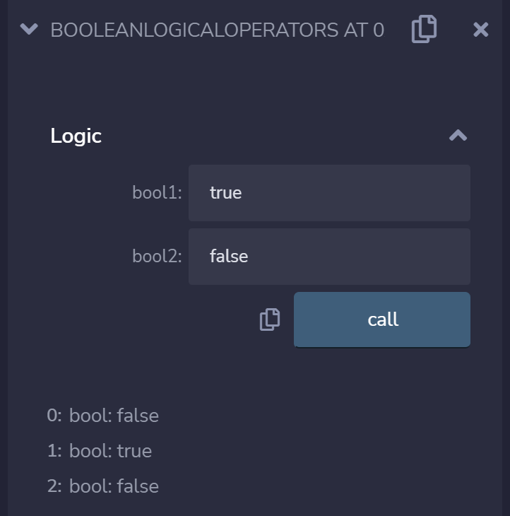
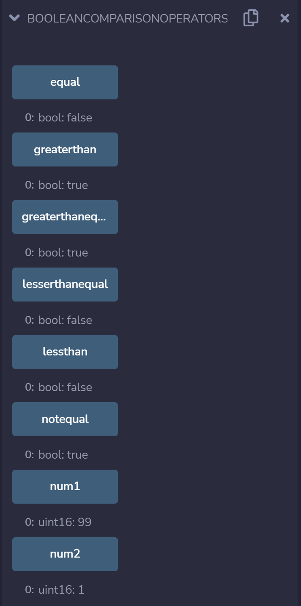
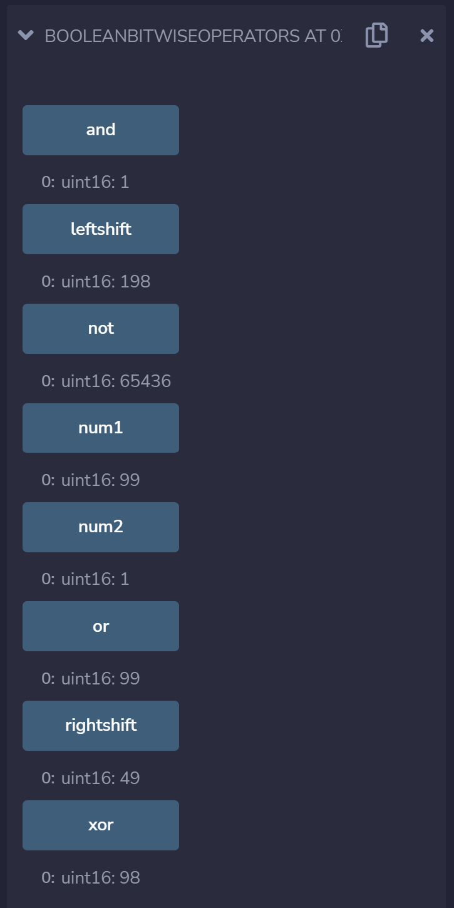

# 3b 布林

布林是一种逻辑数据类型，主要用来记录两种值：真（True）和假（False）。

## 布林的操作

### 布林的真和假
Solidity支持布林值的存取。

> `Boolean-1.sol`
```
pragma solidity ^0.8.10;

contract Boolean {
    bool public bool1;

    function setMyBool(bool _bool1) public {
        bool1 = _bool1;
    }

}
```

`bool1`的值会随着`_bool1`的最新值，而有相应的改变。



可以观察到，`_bool1` 设置为false后，`bool1`也变成了false。

### 逻辑运算符
Solidity支持逻辑运算符，例如：&&（逻辑与），||（逻辑或），!（逻辑非）。

> `Boolean-2.sol`
```
pragma solidity ^0.8.10;

contract BooleanLogicalOperators{
     // Logical operators
     function Logic(bool bool1, bool bool2) public view returns(
       bool, bool, bool){
        
       // Logical && operator 
       bool and = bool1&&bool2;
        
       // Logical || operator 
       bool or = bool1||bool2;
        
       // Logical ! operator
       bool not = !bool1;
       return (and, or, not);
 }
}
```

`and`的值会逻辑与`bool1`和`bool2`，`or`的值会逻辑或`bool1`和`bool2`和`not`的值会逻辑非`bool1`。



可以观察到，当`bool1` 设置为true和`bool2`设置为false后，`and`的值变成`false`，`or`的值变成`true`和`not`的值变成`false`。

### 比较运算符
Solidity支持支持逻辑运算符，例如：==（等号），!=（不等于），>（大于号），<（小于号），>=（大于等于号），<=（小于等于号）。

> `Boolean-3.sol`
```
pragma solidity ^0.8.10;

contract BooleanComparisonOperators{
    // Declaring two variables - num1 and num2
    uint16 public num1 = 99;
    uint16 public num2 = 1;
 
    // Initializing equal variable with bool equal result
    bool public equal = num1 == num2;
 
    // Initializing notequal variable with bool not equal result
    bool public notequal = num1 != num2;
    
    // Initializing greaterthan variable with bool greater than result
    bool public greaterthan = num1 > num2;
 
    // Initializing lessthan variable with bool less than result
    bool public lessthan = num1 < num2;
 
    // Initializing greaterthanequal variable with bool greater than equal to result
    bool public greaterthanequal = num1 >= num2;
 
    // Initializing lesserthanequal variable bool less than equal to result
    bool public lesserthanequal = num1 <= num2;
}
```

`equal`，`notequal`，`greaterthan`，`lessthan`，`greaterthanequal`和`lesserthanequal`的值会根据`num1`和`num2`的值而做出相应的改变。



可以观察到，当`num1` 设置为99和`num2`设置为1后，`equal`的值变成`false`，`notequal`的值变成`true`，`greaterthan`的值变成`true`，`lessthan`的值变成`false`，`greaterthanequal`的值变成`true`，`lesserthanequal`的值变成`false`。

### 位运算符
Solidity支持位运算符，例如：&（按位与），|（按位或），^（按位异或），<<（左移），>>（右移）和~（取反）。

> `Boolean-4.sol`
```
pragma solidity ^0.8.10;

contract BooleanBitwiseOperators{
    // Declaring two variables - num1 and num2
    uint16 public num1 = 99;
    uint16 public num2 = 1;
 
    // Initializing and variable to '&' value
    uint16 public and = num1 & num2;
 
    // Initializing or variable to '|' value
    uint16 public or = num1 | num2;
 
    // Initializing xor variable to '^' value
    uint16 public xor = num1 ^ num2;
 
    // Initializing leftshift variable to '<<' value
    uint16 public leftshift = num1 << num2;
 
    // Initializing rightshift variable to '>>' value
    uint16 public rightshift = num1 >> num2;
   
    // Initializing not variable to '~' value
    uint16 public not = ~num1 ;
}
```

`and`，`or`，`xor`，`leftshift`，`rightshift`和`not`的值会根据`num1`和`num2`的值而做出相应的改变。



可以观察到，当`num1` 设置为99和`num2`设置为1后，`and`的值变成`1`，`or`的值变成`99`，`xor`的值变成`98`，`leftshift`的值变成`198`，`rightshift`的值变成`49`，`not`的值变成`65436`。

参考资料
1. https://ethereum-blockchain-developer.com/010-solidity-basics/02-boolean/
2. https://www.geeksforgeeks.org/solidity-operators/

THUBA DAO版权所有，盗用必究
