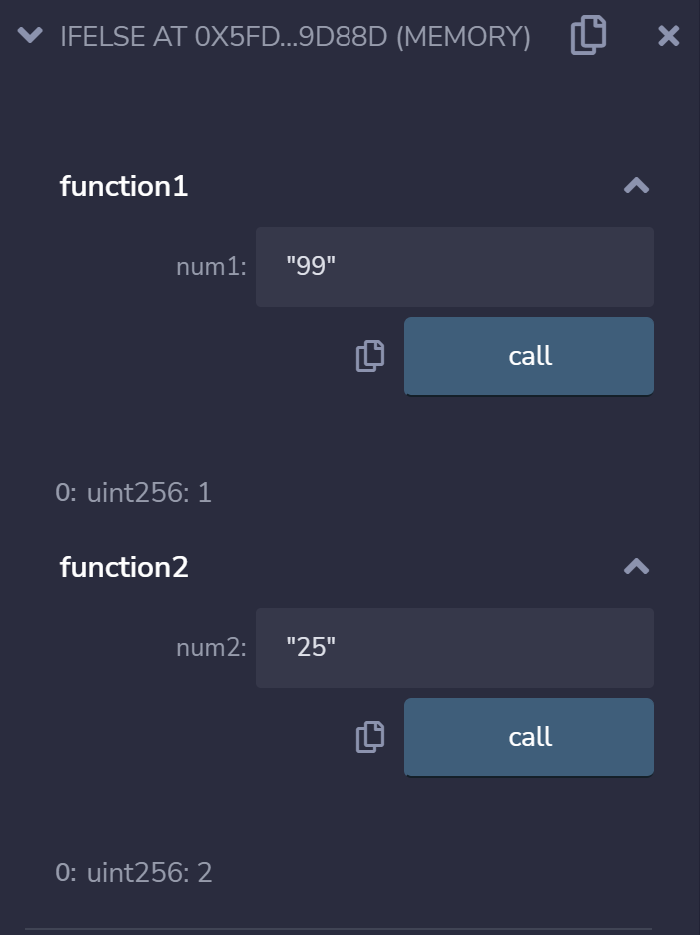
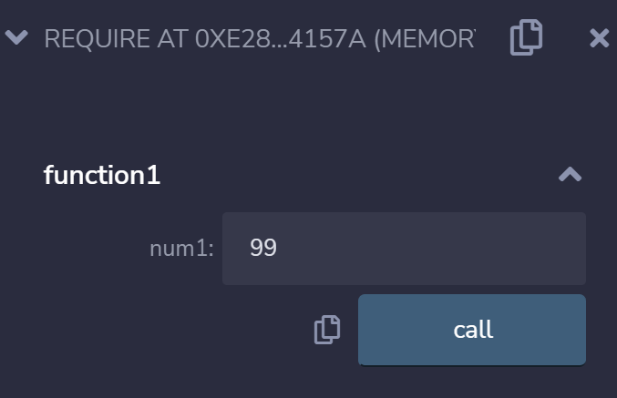
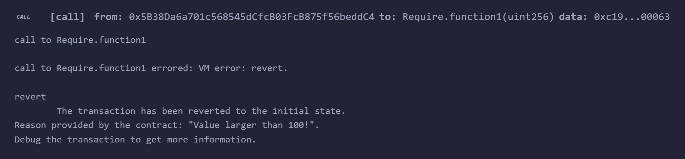

# 3c 条件语句

条件语句是判断给定的条件是否满足，并根据判断的结果来返回结果。

## 条件语句的操作

### 条件语句的If和Else
Solidity支持If和Else条件语句。

> `If-Else-1.sol`
```
pragma solidity ^0.8.10;

contract IfElse {
    function function1(uint num1) public pure returns (uint) {
        if (num1 < 50) {
            return 2;
        } else {
            return 1;
        }
    }

    function function2(uint num2) public pure returns (uint) {
        // Simplified way to write if / else statement
        return num2 < 50 ? 2 : 1;
    }
}
```

`function1`和`function2`的值会随着`if-else`结果，而返回1或2。



可以观察到，当`function1`的输入值是99时，而返回1；反观，当`function2`的输入值是25时，而返回2。

### 条件语句的Require
Solidity支持Require条件语句。

> `If-Else-2.sol`
```
pragma solidity ^0.8.10;

contract Require {
    function function1(uint16 num1) public pure {
        require (num1 <= 100, "Value less than 100!");
        require (num1 > 100, "Value larger than 100!");
    }
}
```

`require`会随着`num1`值，而返回结果。




可以观察到，当`num1`的输入值是99时，`require`启动而显示"Value less than 100!"。

参考资料
1. https://solidity-by-example.org/if-else
2. https://web3dev.tips/tips/using-require-statements-in-solidity

THUBA DAO版权所有，盗用必究