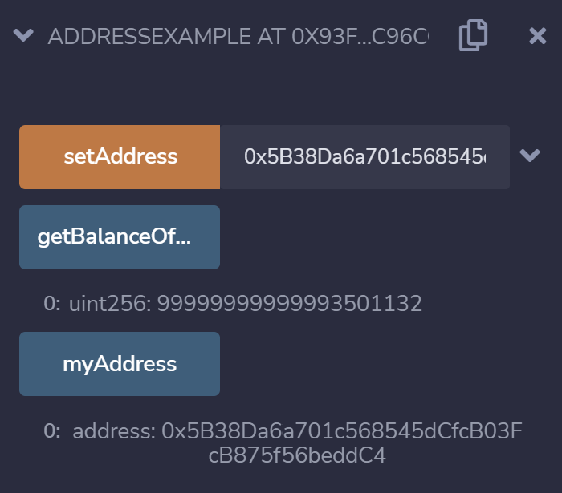

# 3d Address

地址是所有合约的基础，所有的合约都会继承地址对象，也可以随时将一个地址串，得到对应的代码进行调用。
## 地址

Solidity支持地址。以太坊地址的长度，大小20个字节，160位，所以可以用一个uint160编码。

> `Address.sol`
```
pragma solidity ^0.8.10;

contract Address {
    address public myAddress;

    function setAddress(address _address) public {
        myAddress = _address;
    }

    function getBalanceOfAccount() public view returns(uint) {
        return myAddress.balance;
    }
}
```

`myAddress`是这里的主角，并使用了`address`。



可以观察到，当`setAddress`的输入值是0x5B38Da6a701c568545dCfcB03FcB875f56beddC4时，而myAddress会返回同样的值；而`getBalanceOfAccount`会返回账户值99999999999993270653。

参考资料
1. https://ethereum-blockchain-developer.com/010-solidity-basics/04-address-types/
2. https://solidity.tryblockchain.org/Solidity-Type-Address-%E5%9C%B0%E5%9D%80.html

THUBA DAO版权所有，盗用必究