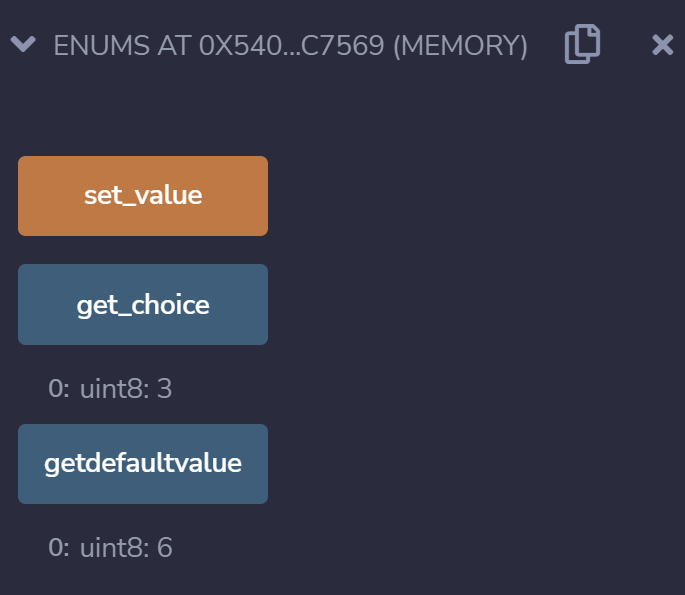
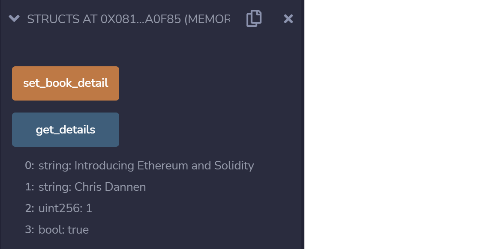

# 3e 枚举 & 结构体

## 枚举

Solidity支持枚举类型。枚举类型是在Solidity中的一种用户自定义类型。可以显示的转换与整数进行转换，但不能进行隐式转换。显示的转换会在运行时检查数值范围。枚举类型应至少有一名成员。

> `Enums.sol`
```
pragma solidity ^0.8.10;

contract Enums {
    // Create an enumerator
    enum week_days
    {
      Monday,
      Tuesday,
      Wednesday,
      Thursday,
      Friday,
      Saturday,
      Sunday
     } 
 
    // Declare variables of type enumerator
    week_days week;   
     
    week_days choice;
 
    // Set a default value
    week_days constant default_value
      = week_days.Sunday;
     
    // Define a function to set value of choice
    function set_value() public {
      choice = week_days.Thursday;
    }
 
    // Define a function to return value of choice
    function get_choice(
    ) public view returns (week_days) {
      return choice;
    }
       
    // Define function to return default value
    function getdefaultvalue(
    ) public pure returns(week_days) { 
        return default_value; 
    } 
}
```

`default_value`的初始值会是week_days.Sunday，即是6，而`choice`的初始值会是week_days.Thursday，即是3。



可以观察到，当`choice`的值是3时，`get_choice`会变成3。当`default_value`的值是6时，`getdefaultvalue`会变成6。

### 结构体
Solidity支持结构体，用于映射和数组中作为元素。

> `Structs.sol`
```
pragma solidity ^0.8.10;

contract Structs {
 
   // Declare a structure
   struct Book {
      string name;
      string author;
      uint id;
      bool available;
   }
 
   // Declare a structure object
   Book book1;

   // Define a function to set values for the fields for structure book1
   function set_book_detail() public {
      book1 = Book("Introducing Ethereum and Solidity",
                   "Chris Dannen",
                    1, true);
   }

   // Defining function to print book1 details
   function get_details(
   ) public view returns (string memory, string memory, uint, bool) {
      return (book1.name, book1.author, book1.id, book1.available);
   }
}
```

`Book`结构体包含name，author，id和available。



可以观察到，当点击`set_book_detail`以及`get_details`后，会显示name，author，id和available储存的值。

参考资料
1. https://www.geeksforgeeks.org/solidity-enums-and-structs/
2. https://solidity.tryblockchain.org/Solidity-Type-Enum-%E6%9E%9A%E4%B8%BE.html
3. https://solidity.tryblockchain.org/Solidity-Struct-%E6%95%B0%E6%8D%AE%E7%BB%93%E6%9E%84.html

THUBA DAO版权所有，盗用必究