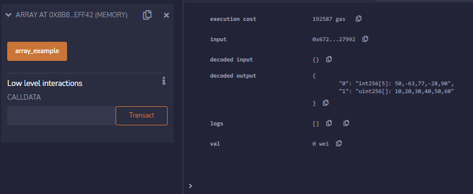
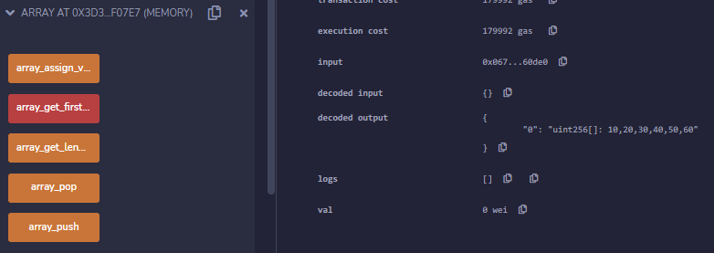
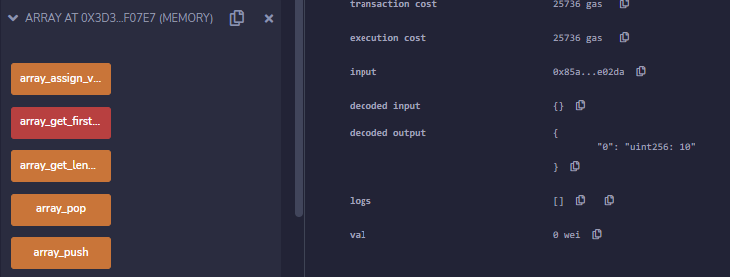
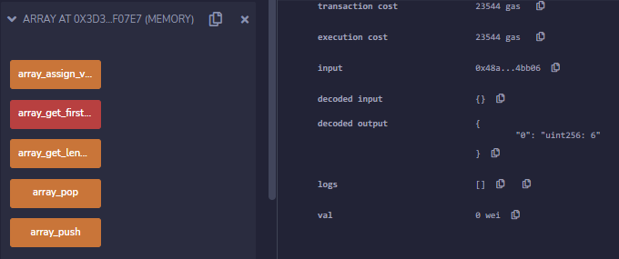
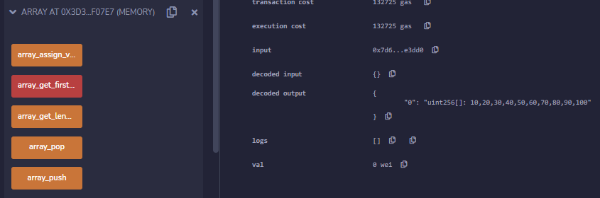
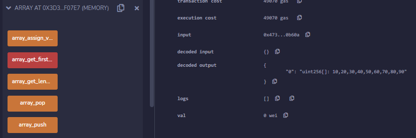

# 3f 数组

## 数组

### 定长数组和变长数组

Solidity支持数组类型。支持编译期定长数组（Fixed Array）和变长数组（Dynamic Array）。一个类型为T，长度为k的定长数组，可以声明为T[k]，而一个变长数组则声明为T[]。

> `Array-1.sol`
```
pragma solidity ^0.8.10;

contract Array {  
  
    // Declare fixed array
    int[5] array1 = [int(50), -63, 77, -28, 90]; 
    // Declare dynamic array
    uint[] array2;    
      
    // Define function to add values to an array 
    function array_example() public returns (int[5] memory, uint[] memory){  
        // Assign values to dynamic array
        array2 = [uint(10), 20, 30, 40, 50, 60];
                
        return (array1, array2);  
    }
}
```

`array1`是定长数组，而`array2`是变长数组。



可以观察到，`array1`的值是int256[5]: 50,-63,77,-28,90，而`array2`的值是uint256[]: 10,20,30,40,50,60。

### 数组支持的操作
Solidity的数组有一个length属性，表示当前的数组长度。对于storage的变长数组，可以通过给length赋值调整数组长度。push可以将一个新元素附加到数组末端。pop可以将最后一个元素从数组移除。

> `Array-2.sol`
```
pragma solidity ^0.8.10;

contract Array2 {  
  
    // Declare fixed size array
    int[5] array1 = [int(50), -63, 77, -28, 90]; 
    // Declare dynamic array
    uint[] array2;    

    // Define function to add values to an array 
    function array_assign_values() public returns (uint[] memory){  
        // Assign values to dynamic array
        array2 = [uint(10), 20, 30, 40, 50, 60];
                
        return (array2);  
    }

    // Array Operations - Access Array Element
    function array_get_first_element_value() public payable returns (uint){  
        uint first_value = array2[0];
        return first_value;  
    }

    // Array Operations - Get Length of Array
    function array_get_length() public returns(uint) {  
        uint x = array2.length;
        return x; 
    } 

    // Array Operations - Push New Element Into Array
    function array_push() public returns(uint[] memory){  
        array2.push(70);  
        array2.push(80);  
        array2.push(90);
        array2.push(100);
    
        return array2;  
    }  

    // Array Operations - Pop (aka Remove) Last Element From Array
    function array_pop() public returns(uint[] memory){  
        array2.pop(); 
        return array2;  
    }  
}
```

`array_get_first_element_value`函数可以读取数组第一的数值。`array_get_length`函数可以读取当前的数组长度。`array_push`函数可以将新元素附加到数组末端。`array_pop`函数可以将最后一个元素从数组移除。







可以观察到，当点击`array_get_first_element_value`后，`array2`的第一个元素值是10。当点击`array_get_length`后，`array2`的长度是6。当点击`array_push`后，`array2`的值是uint256[]: 10,20,30,40,50,60,70,80,90,100。当点击`array_pop`后，`array2`的值是uint256[]: 10,20,30,40,50,60,70,80,90。

参考资料
1. https://www.geeksforgeeks.org/solidity-arrays/
2. https://me.tryblockchain.org/solidity-array.html

THUBA DAO版权所有，盗用必究