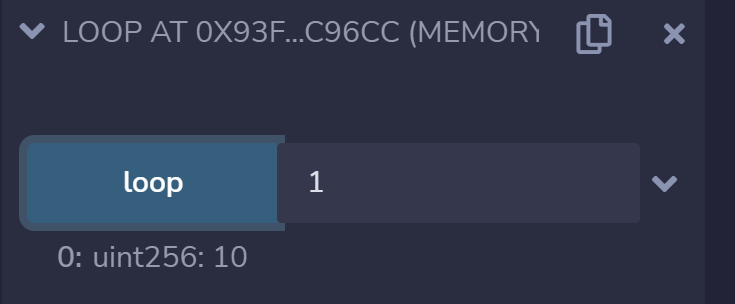
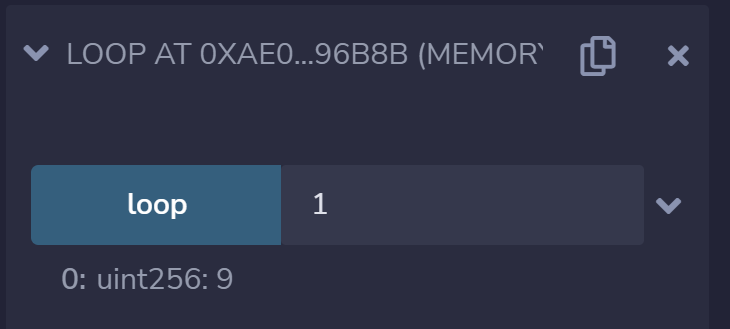
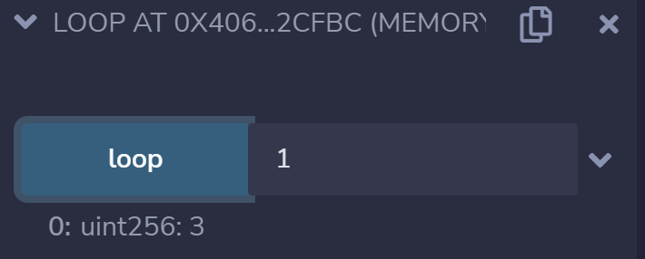
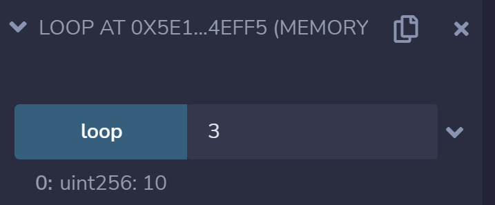

# 4 循环语句

Solidity支持循环语句，本章中主要介绍`while`,`do while`,`for`,`break、continue`。


## 循环语句的操作

### 循环语句的for
Solidity支持for语句，同时我们也借由for语句讲一下Solidity中的continue与break语句。

> `for.sol`
```solidity
pragma solidity ^0.8.10;

contract Loop {
    function loop(uint num1) public pure returns (uint) {
        // for loop
        for (uint i = num1; i < 10; i++) {
            num1++;
        }
        return num1;
    }
}
```

可见Solidity的循环语句和C等语言比较相似，循环开始时根据第一项`uint i = num1`，定义出来一个新变量i，并领取等于变量num1，然后之后的每一轮循环在判断`i<10`是否为真之后，如果为真则进行下一轮，同时`i++`也就是变量i加一；如果为假，则中止循环。
但当引入比如continue和break语句之后，就可以让整个循环变得不一样。

> `for-continue.sol`
```solidity
pragma solidity ^0.8.10;

contract Loop {
    function loop(uint num1) public pure returns (uint) {
        // for loop
        for (uint i = num1; i < 10; i++) {
            if (i == 3) {
                // 使用continue使得循环直接进入下一轮
                continue;
            }
            num1++;
        }
        return num1;
    }
}
```



可以观察到，本身循环应该输出结果是10，但是引入`continue`之后输出结果是9，是因为跳过了`i==3`的那一轮。

> `for-break.sol`
```solidity
pragma solidity ^0.8.10;

contract Loop {
    function loop(uint num1) public pure returns (uint) {
        // for loop
        for (uint i = num1; i < 10; i++) {
            if (i == 3) {
                // 使用break直接停止循环
                break;
            }
            num1++;
        }
        return num1;
    }
}
```



而引入`break`之后输出结果是3，是因为循环直接停在了`i==3`的那一轮。

> `while.sol`
```solidity
pragma solidity ^0.8.10;

contract Loop {
    function loop(uint num1) public pure returns (uint) {
        while (num1 < 10) {
            num1++;
        }
        return num1;
    }
}
```


Solidity中的while语句与其他语言比较类似，每一轮循环在判断`num1 < 10`是否为真之后，如果为真则进行下一轮；如果为假，则中止循环。

参考资料
1. https://solidity-by-example.org/loop

THUBA DAO版权所有，盗用必究