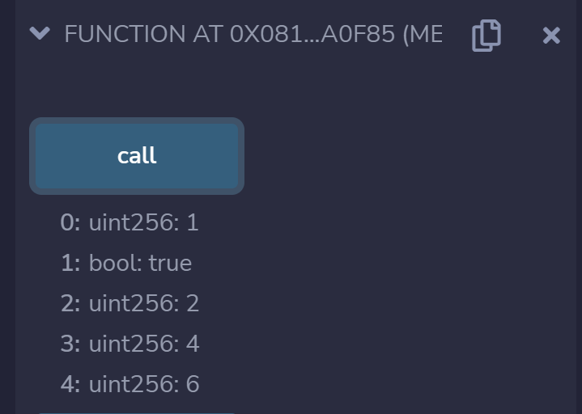

# 5 函数

Solidity支持函数定义，本章中主要介绍函数的定义，以及其可以有的输入输出。


### 函数的返回结果
Solidity的函数支持返回的结果中可以包含多项。

> `function-multi.sol`
```solidity
pragma solidity ^0.8.10;

contract Function {
    // 函数返回的结果中可以包含多项
    function returnMany()
        public
        pure
        returns (
            uint,
            bool,
            uint
        )
    {
        return (1, true, 2);
    }
}
```


### 函数的中调用其他函数

> `function-call.sol`
```solidity
// SPDX-License-Identifier: MIT
pragma solidity ^0.8.10;

contract Function {
    function returnMany()
        public
        pure
        returns (
            uint,
            bool,
            uint
        )
    {
        return (1, true, 2);
    }

    // 调用上个函数
    function call()
        public
        pure
        returns (
            uint,
            bool,
            uint,
            uint,
            uint
        )
    {
        (uint i, bool b, uint j) = returnMany();

        // Values can be left out.
        (uint x, , uint y) = (4, 5, 6);

        return (i, b, j, x, y);
    }
}
```


可见在`call`函数之中调用了`returnMany`函数的返回结果。


参考资料
1. https://solidity-by-example.org/function

THUBA DAO版权所有，盗用必究