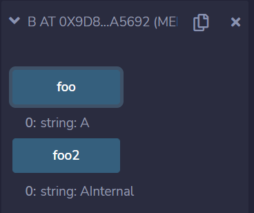
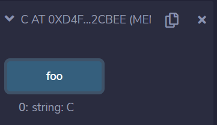
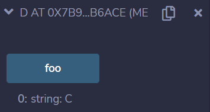

# 6 合约

Solidity支持合约定义，其类似于其他语言之中的“类”。
本章中主要介绍合约的一些特性，比如继承、interface。


### 合约的继承（inheritance）

Solidity使用is语句，表示继承关系。

> `contract-inheritance1.sol`
```solidity
contract A {
    function foo() public pure virtual returns (string memory) {
        return "A";
    }
    function fooInternal() internal pure virtual returns (string memory) {
        return "AInternal";
    }
    function fooPrivate() private pure returns (string memory) {
        return "APrivate";
    }
}

// 使用is继承
contract B is A {
    function foo2() public pure virtual returns (string memory) {
        // 调用Internal权限的函数
        return fooInternal();
    }
}
```


可见Solidity的继承语句`is`继承之后，B类具有了A类的public、internal权限的函数。

> `contract-inheritance-override.sol`
```
pragma solidity ^0.8.10;

contract A {
    function foo() public pure virtual returns (string memory) {
        return "A";
    }
    function fooInternal() internal pure virtual returns (string memory) {
        return "AInternal";
    }
    function fooPrivate() private pure returns (string memory) {
        return "APrivate";
    }
}

contract C is A {
    // Override A.foo()
    function foo() public pure virtual override returns (string memory) {
        return "C";
    }
}
```



可见Solidity的继承语句`is`继承之后，C类同样具有了A类的public、internal权限的函数。但是C类override了其中的foo函数，使得其调用结果不同于A。

> `contract-inheritance2.sol`
```
pragma solidity ^0.8.10;

contract A {
    function foo() public pure virtual returns (string memory) {
        return "A";
    }
    function fooInternal() internal pure virtual returns (string memory) {
        return "AInternal";
    }
    function fooPrivate() private pure returns (string memory) {
        return "APrivate";
    }
}

contract C is A {
    // Override A.foo()
    function foo() public pure virtual override returns (string memory) {
        return "C";
    }
}

contract D is A, C {
    function foo() public pure override(A, C) returns (string memory) {
        return super.foo();
    }
}
```


当一个合约继承了多个合约时，由结果可见，其会优先继承更靠右侧的合约。

### interface

> `interface.sol`
```
pragma solidity ^0.8.10;

contract cat{
    string name;
    function eat() public returns(string memory){
        return "cat eat fish";
    }
}

contract dog{
    string name;
    function eat() public returns(string memory){
        return "dog miss you";
    }
}

interface animalEat{
      function eat() external returns(string memory);
}

contract animal{
    function test(address _addr) public returns(string memory){
        animalEat generalEat = animalEat(_addr);
        return generalEat.eat();
    }
}
```

在合约 animal 中，调用函数 test，如果传递的是部署的 cat 的合约地址，那么我们在调用接口的 eat 方法时，实则调用了cat 合约的 eat 方法。 同理，如果传递的是部署的 dog 的合约地址，那么我们在调用接口的 eat 方法时，实则调用了 dog 合约的 eat 方法。


参考资料
1. http://www.codebaoku.com/solidity/solidity-interface.html
2. https://solidity-by-example.org/inheritance

THUBA DAO版权所有，盗用必究