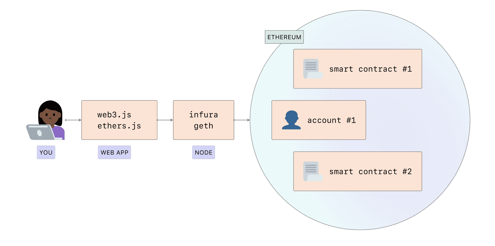
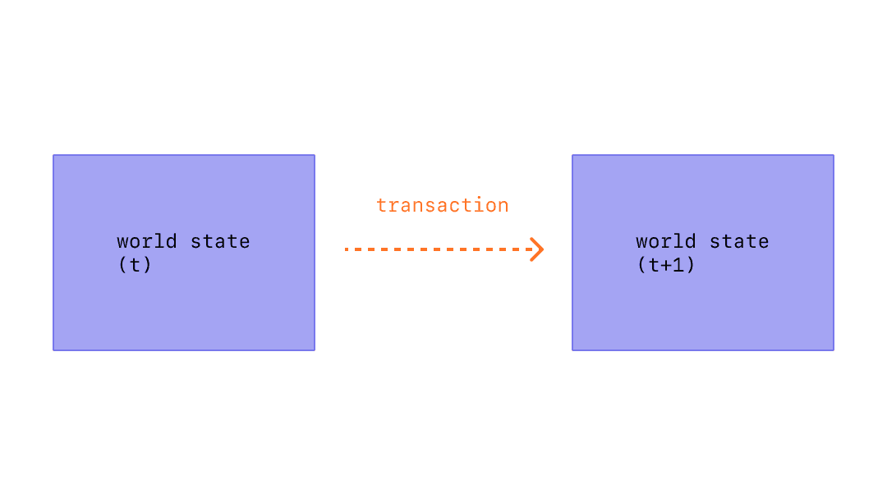
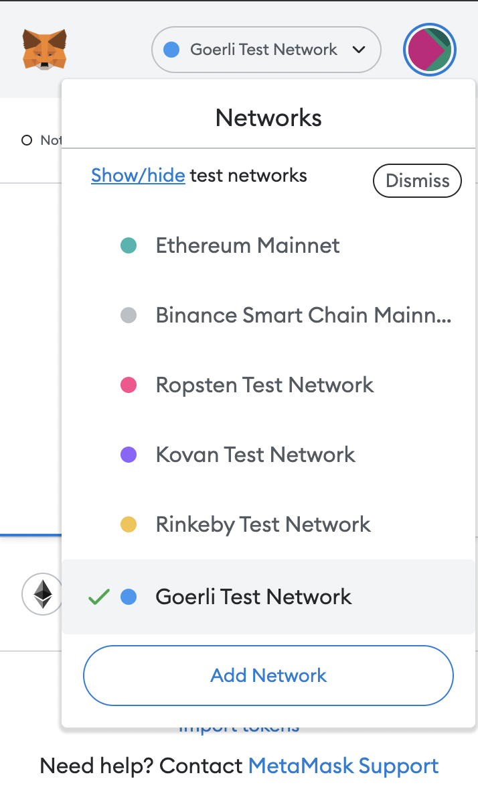
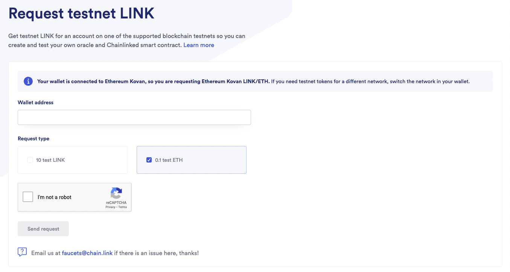

# 1. 章节简介

这一章的学习目标是掌握以太坊网络交互的基础，首先介绍几个重要的概念。

## 以太坊节点

图片来源：ethereum.org

以太网是一个有计算机组成的分布式网络，运行可验证区块和交易数据的软件（称为节点）。您需要一个被称为客户端的应用程序，才能在您的设备上“运行”一个节点。

要和以太坊以太坊进行交互，普通用户可以直接通过钱包连接 DApp 进行相应的操作。对于开发者而言，我们可以使用适合的库，如：web3.js 或 ethers.js 和一个以太坊结点进行交互，实现在以太坊网络上的某种交易。

要连接到一个以太坊的节点，我们可以选择使用本地运行的 geth，或者直接使用 Infura。由于在本地运行 geth 需要下载大量的数据，非常麻烦，因此我们建议大家使用 Infura。

## 账号和交易

图片来源：ethereum.org

在第三节的时候，我们曾经提过账号和交易的概念。

以太坊帐户是一个具有以太币 (ETH) 余额的实体，可以在以太坊上发送交易。 帐户可以由用户控制，也可以作为智能合约部署。

以太坊中的交易则指的是由某个账号发出并带密码学签名的指令。这个指令可以改变以太网络的状态。这些指令包括：部署智能合约、调用智能合约中的函数等。每个交易都会消耗一些 Gas 费用，会使用账号中的以太币。

如果你有学习过网页开发，你可以设想一个交易如同调用后端 API 后所执行的函数，而要调用这个 API 则需要使用以上提到的 web3.js 和 ethers.js 等，而这个 API 位于一个以太坊结点中，而这个状态会逐渐传到整个以太网中。

有关账号和交易更多的详细介绍，请回看第三节的课程内容。

## 测试网

以太网络可以分成主网和测试网。主网是以太网主要的生态区块链，所有具有实际价值的交易都会发生在主网内，每个账号所持有的以太币也是具有实际价值的以太币。

除了主网，以太网也有一种模拟生态环境的网络——测试网，协议开发者或智能合约开发者可以使用测试网来测试尚未部署到主网上的协议和合约，相当于一个用于测试和模拟。

目前为止，测试网有这几个：
1. Görli
2. Kovan
3. Rinkeby
4. Ropsten

截止 2022 年，Kovan、Rinkeby 和 Ropsten 都已经被弃用，本章节会使用 Görli 网络。

我们可以在 MetaMask 中切换到我们想使用的网络。

## 测试网水龙头

由于在以太网中的交易会消耗 Gas，而且测试网上的以太币并不具有任何价值，所以我们都到每个测试网的水龙头获得测试网的以太币。

在网上搜索 Görli 水龙头可以找到很多的结果。大多数的水龙头会要求开发者在推特发文才能获取以太币，因此我们建议不需要这些步骤的 [Chainlink](https://faucets.chain.link/) 水龙头。

明白了这些概念之后，我们就可以开始学习以太坊的交互。

参考资料
1. https://ethereum.org/zh/developers/docs/nodes-and-clients/
2. https://ethereum.org/zh/developers/docs/accounts/
3. https://ethereum.org/zh/developers/docs/transactions/
4. https://ethereum.org/zh/developers/docs/networks/
THUBA DAO版权所有，盗用必究