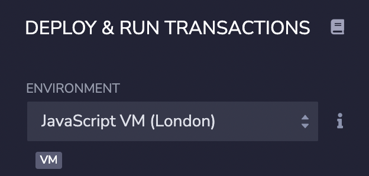
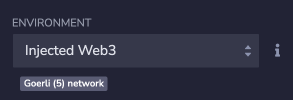
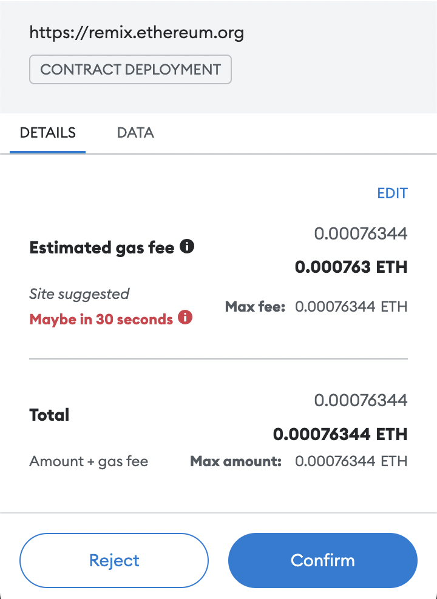
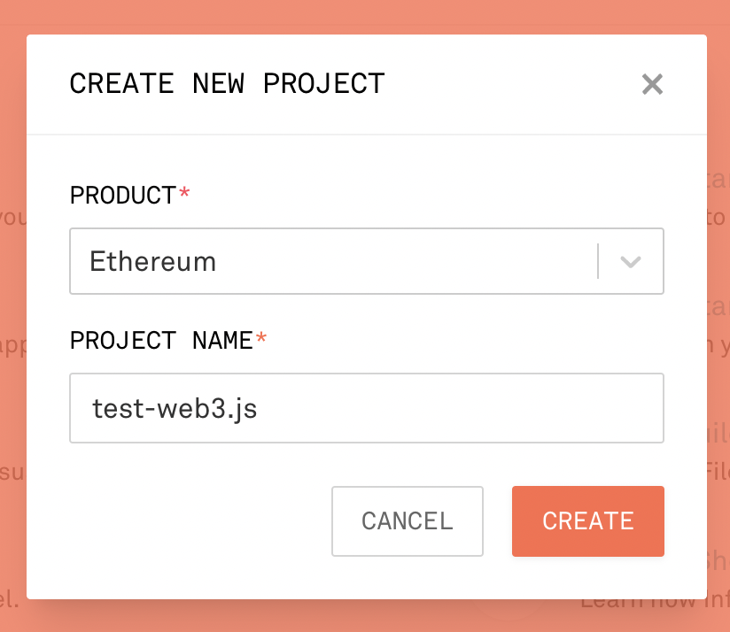

# 2. 部署

上一小节提到了账号、测试网、交易等概念。这一小节，我们要了解如何使用 Web3.js 部署一个智能合约到 Görli 测试网上。

在使用 Web3.js 之前，我们先尝试使用 Remix IDE 将合约部署到 Görli 测试网上。

## 通过 Remix 部署

> Number.sol

```solidity
pragma solidity ^0.8.7;

contract Number {
    uint256 public number;

    constructor(uint256 initNum) {
        number = initNum;
    }

    function add(uint256 x) public {
        require(x > 0, "add value must be positive");
        number = number + x;
    }

    function minus(uint256 x) public {
        require(x > 0, "minus value must be positive");
        number = number - x;
    }

    function set(uint256 x) public {
        number = x;
    }

    function get() public view returns (uint256) {
        return number;
    }
}
```

在 Remix 上创建 `Number.sol`，编译后到部署界面，可以看到 Environment 默认为 JavaScript VM (London)。



JavaScript VM 是一个虚拟的运行环境，所有的账号、交易等信息都在浏览器内进行，没有连接到任何一个结点。

当我们想要将这个合约部署到 Görli 测试网上时，选择 Injected Web3。此刻，MetaMask 会马上跳出来要求你的允许钱包连接到 Remix 中。允许之后，在 MetaMask 中切换到 Görli 测试网。请确保你的钱包里有足够的以太币。



点击部署的时候，MetaMask 会再次弹出询问是否要允许通过你的账号来部署这个合约，并显示了部署会消耗的 gas。



## 通过 Web3.js 部署

和以上相同的过程，通过 Web3.js 要怎么做？

### 安装

必须预先安装 Node 在。打开新的目录 `/web3-deploy`，使用 npm 安装这些库：

```bash
npm i web3 solc dotenv
```

### 所需的密钥

部署合约需要用到 2 个密钥：以太坊账号的密钥和 Infura ID。

以太坊账号的密钥可以通过 MetaMask 导出，具体步骤可以回看第二节。

Infura ID 则可以在创建项目的时候获取。在 infura.io 注册新账号并开设一个新的项目，并获取项目的 ID。



在 `/web3-deploy` 的根目录下创建一个 `.env` 文件用于储存环境变量
> .env
```
PRIVATE_KEY=xxxxx
INFURA_ID=yyyyy
```
将这两个迷哟填写在相应的位置。

### 使用 solc 编译智能合约

创建 `compile.js`，并填写以下内容。

> compile.js
```javascript
const fs = require('fs');
const solc = require('solc');
const source = fs.readFileSync("Number.sol", "utf8");

const input = {
    language: "Solidity",
    sources: {
        "Number.sol": {
            content: source,
        },
    },
    settings: {
        outputSelection: {
            "*": {
                "*": ["*"],
            },
        },
    },
};
  
const tempFile = JSON.parse(solc.compile(JSON.stringify(input)));
const contractFile = tempFile.contracts["Number.sol"]["Number"];
module.exports = contractFile
```

这段代码的目的在于编译 `Number.sol`。在编译之后，这段代码会导出 `contractFile`。大家可以尝试将 `contractFile` 通过 `console.log` 输出，观察里面的内容。

### 使用 web3.js 部署智能合约

#### 1. 读取已经部署的合约

在 `compile.js` 编译了智能合约之后，现在要通过 `index.js` 将这个智能合约部署到网络上。

由于我们在 `compile.js` 中导出了 `contractFile`

```javascript
module.exports = contractFile
```

因此，我们可以在 `index.js` 通过以下方式获取 `contractFile`

```javascript
const contractFile = require('./compile');
const bytecode = contractFile.evm.bytecode.object;
const abi = contractFile.abi;
```

`bytecode` 是合约在 EVM 上执行的二进制形式。
`abi` 是跟合约 `bytecode` 进行交互的接口。

#### 2. 读取环境变量

```javascript
require('dotenv').config();
const privateKey = process.env.PRIVATE_KEY;
const infuraId = process.env.INFURA_ID
```

#### 3. 构造 `web3` 和 `account` 对象

```javascript
const Web3 = require('web3');
const web3 = new Web3('https://goerli.infura.io/v3/' + infuraId);
const account = web3.eth.accounts.privateKeyToAccount(privateKey);
```

#### 4. 部署合约的函数

```javascript
const deploy = async() => {
    const contract = new web3.eth.Contract(abi);
    const deployTx = contract.deploy({
        data: bytecode,
        arguments: [10], // 构造函数 initNum 的参数
    });
    const transaction = await web3.eth.accounts.signTransaction(
        {
            data: deployTx.encodeABI(), // 交易内容
            gas: 8000000,
        },
        account.privateKey // 使用钱包私钥签名
    );
    const receipt = await web3.eth.sendSignedTransaction(
        transaction.rawTransaction
    );
    console.log(`Contract address: ${receipt.contractAddress}`); // 获取合约地址
}
```

参考资料
1. https://github.com/Dapp-Learning-DAO/Dapp-Learning/tree/main/basic/01-web3js-deploy
2. https://medium.com/@eiki1212/explaining-ethereum-contract-abi-evm-bytecode-6afa6e917c3b

THUBA DAO版权所有，盗用必究
