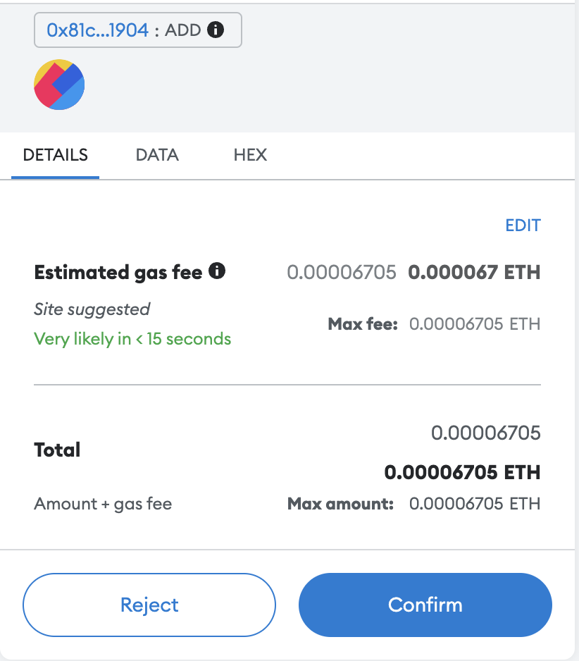

# 3. 交易

## Web3.js 中的交易过程

通过 Web3.js 交易的过程如下：
1. 构建交易对象
2. 签署交易
3. 广播交易

上节提到的部署其实也是交易的一种，回顾上一小节的部署函数
```javascript
const deploy = async() => {
    const contract = new web3.eth.Contract(abi);
    const deployTx = contract.deploy({
        data: bytecode,
        arguments: [10],
    }); // 1. 创建交易对象
    const transaction = await web3.eth.accounts.signTransaction(
        {
            data: deployTx.encodeABI(),
            gas: 8000000,
        },
        account.privateKey
    );  // 2. 签署交易
    const receipt = await web3.eth.sendSignedTransaction(
        transaction.rawTransaction
    ); // 3. 广播交易
    console.log(`Contract address: ${receipt.contractAddress}`); // 获取合约地址
}
```
我们可以明显看出这三个步骤在代码中的实现方式。

## 更多的交易例子

### 回顾 Remix IDE

回顾上节在 Remix 上部署的智能合约。此时，如果调用 `add` 函数，我们可以发现 MetaMask 会弹出来让我们确认是否要支付 gas 费用。



但是，当我们调用 `get` 的时候，MetaMask 并不会跳出来。

这是因为 `add` 函数改变了以太网络的状态，这种情况是必须消耗 gas 费用的。但是 `get` 函数并不会改变以太网络的状态，因此不会消耗 gas 费用。

### Web3.js 进行交易

和以上相同的过程，在 Web3.js 能如何实现？这里将解释如何实现调用 `add` 和 `get`。

#### 1. 获取合约地址

在上一小节部署之后，命令行会出现该合约的地址。将这个地址粘贴到 `.env` 内

> `.env`
```
PRIVATE_KEY=xxxxxx
INFURA_ID=yyyyyy
CONTRACT_ADDRESS=zzzzzz
```

#### 2. 获取合约 abi

```javascript
const contractFile = require('./compile');
const abi = contractFile.abi;
```

#### 3. 调用 `add`

```javascript
    const number = new web3.eth.Contract(abi, contractAddress);
    const add = number.methods.add(10);  // 构建交易对象
    const transaction = await web3.eth.accounts.signTransaction(
        {
            to: contractAddress,
            data: add.encodeABI(),
            gas: 8000000,
        },
        account.privateKey
    );  // 签署交易
    const receipt = await web3.eth.sendSignedTransaction(
        transaction.rawTransaction
    );  // 广播交易
    console.log(`Transaction receipt: ${receipt.transactionHash}`);
```

#### 4. 调用 `get`

```javascript
    const num = await number.methods.get().call();
    console.log(`Number stored: ${num}`);
```

参考资料：
1. https://www.qikegu.com/docs/5147
2. https://github.com/Dapp-Learning-DAO/Dapp-Learning/tree/main/basic/02-web3js-transaction

THUBA DAO版权所有，盗用必究