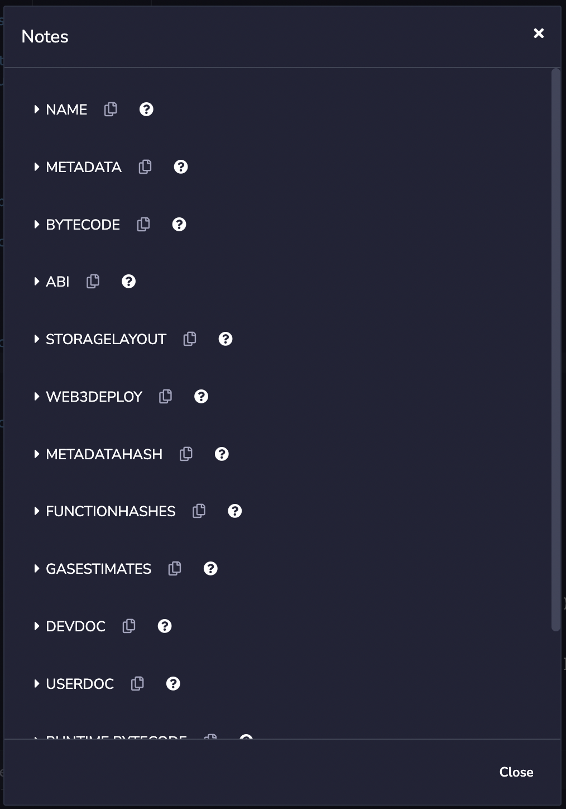

# 6. DApp 前端

本节的学习目标是掌握编写 DApp 前端的基础，讲解几个编写 DApp 前端的重点。

环境配置/所使用的工具：
1. Vue.js 前端
2. Chrome 浏览器 + MetaMask
3. Ethers.js
4. Remix IDE

## 安装和执行
```bash
npm install
npm run dev
```

## 部署合约
通过 Remix 编译合约之后可以获得获取合约地址和合约ABI。

Compile > Compilation Details 会显示以下弹窗。


## 导入
```javascript
import {ethers} from "ethers"
import abi from "../contract/abi.json"
```

## 构造合约
Vue 的 `mounted()` 会在 DOM 加载之后被调用，在这个时候构造一个合约对象，连接到已经部署的合约。

```javascript
mounted() {
  const { ethereum } = window
  if (ethereum) {
    const provider = new ethers.providers.Web3Provider(ethereum)
    const signer = provider.getSigner()
    const contract = new ethers.Contract(
      'contract address',
      abi,
      signer
    )
    this.contract = contract
    console.log(signer)
  } else {
    window.alert('MetaMask not detected')
  }
},
```

## 连接钱包

安装了 MetaMask 的 Chrome 浏览器中，window 部件里面会出现 ethereum 部件。

通过调用以下函数，前端会连接到 MetaMask 中的账号。

```javascript
async connectWallet () {
  try {
    const { ethereum } = window
    if (!ethereum) {
      this.connected = false;
      window.alert('Metamask not detected')
      return
    }
    const accounts = await ethereum.request({method: 'eth_requestAccounts'})
    this.currentAccount = accounts[0]
    this.connected = true;
  } catch (error) {
    this.connected = false;
    window.alert('Error connecting to metamask', error)
  }
},
```

## 实现交易

连接合约和钱包之后，就能实现以下交易

```javascript
async add() {
  try {
    const tx = await this.contract.addNote(this.note.title, this.note.content)
    await transaction.wait();
  } catch (e) {
    console.log(e)
  }
},
```

```javascript
async get() {
  try {
    this.notes = await this.contract.getNotes()
    console.log(this.notes)
  } catch (e) {
    console.log(e)
  }
}
```

```javascript
async remove(id) {
  try {
    const tx = await this.contract.removeNote(id)
    await transaction.wait();
  } catch (e) {
    console.log(e)
  }
},
```

参考资料：
1. https://github.com/elsodev/bank-dapp-vue
2. http://cw.hubwiz.com/card/c/metamask-api/1/2/1/
